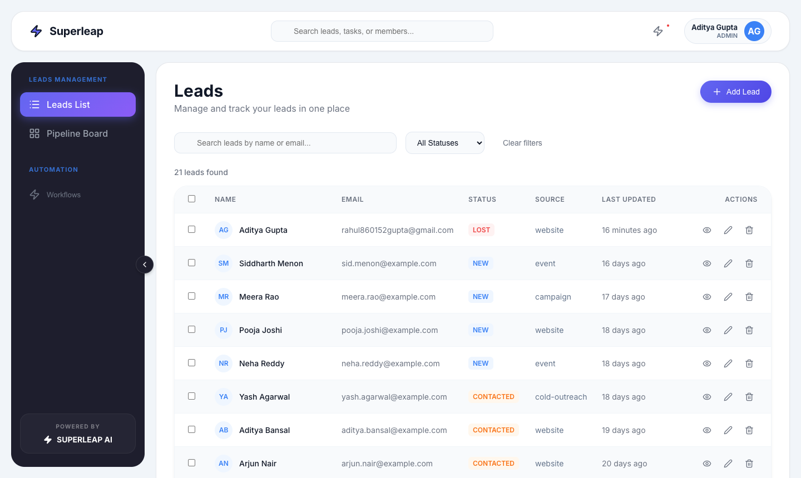
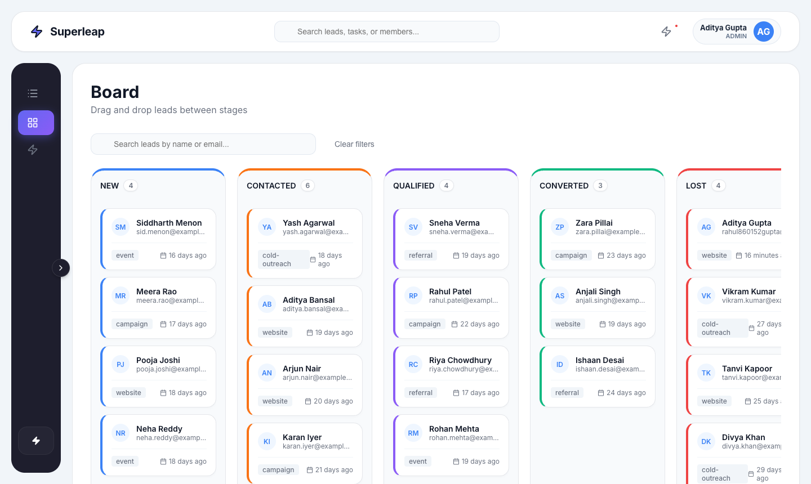

# 🚀 Superleap: Mini Lead CRM


Superleap is a highly interactive, production-ready Mini Lead CRM built with React. It provides a robust interface to track, manage, and transition sales leads through a pipeline using both a classic tabular view and an interactive drag-and-drop Kanban board.

## 🌍 Live Demo

🚀 **[View the Live Deployment Here](https://lead-sync-beige.vercel.app)**

## 📸 Screenshots




## 🎥 Demo Video

> [!NOTE]
> *Insert link to demo video here*

---

## 🏗️ Tech Stack & Justification

| Technology | Purpose | Why it was chosen |
|------------|---------|-------------------|
| **React 18** | UI Library | Component-based architecture with powerful ecosystem for complex interactivity. |
| **TypeScript** | Type Safety | Enhances code reliability, provides excellent DX, and catches bugs at compile time. |
| **Vite** | Build Tool | Blazing fast HMR and optimized production builds. |
| **React Query** | Async State Management | Handles caching, loading/error states, and optimistic UI updates effortlessly. |
| **React Router v6** | Routing | Industry standard for declarative, URL-driven component rendering. |
| **@dnd-kit/core** | Drag & Drop | Highly accessible, performant, and flexible drag-and-drop toolkit. |
| **Sonner** | Toast Notifications | Lightweight, beautiful, and accessible toast notifications. |

## ⚙️ Local Setup

1. **Clone the repository:**
   ```bash
   git clone https://github.com/adityaragaai/LeadSync.git
   cd LeadSync
   ```

2. **Install dependencies:**
   ```bash
   npm install
   ```

3. **Start the development server:**
   ```bash
   npm run dev
   ```

> [!NOTE]
> By default, the application expects a backend API running at `http://localhost:4000`. You can configure this in `src/api/leadApi.ts`.

## 📐 Architecture & Organization

### Project Structure
```text
src/
├── api/          # Axios API client for backend communication
├── components/   # Reusable UI components (Modal, Badge, Navbar)
│   ├── board/    # Kanban-specific (KanbanCard, KanbanColumn)
│   └── leads/    # List-specific (LeadTable, LeadForm, StatusTransition)
├── hooks/        # React Query hooks (useLeads, useLeadActions)
├── pages/        # Route components (LeadsPage, BoardPage)
├── types/        # TypeScript models (Lead, CreateLeadInput, etc.)
└── index.css     # Global CSS and Design Tokens
```

### Components, State, & Async Logic
- **Components** are kept pure and presentation-focused wherever possible.
- **Global State** is minimized. UI state (like active modals or search filters) is driven by the URL (via `useSearchParams`), making the app highly shareable and persistent across reloads.
- **Async Logic** is entirely abstracted into custom hooks (`useLeads`, `useLeadActions`) using `@tanstack/react-query`. Components simply consume data and dispatch mutations.

## ✨ Core Features & Technical Decisions

### URL State Management & Routing Strategy
React Router handles the top-level views (`/leads` and `/board`). Sub-states (like search queries, active status filters, or open modal IDs) are stored in the URL search parameters (e.g., `?status=NEW&edit=123`). This guarantees that a user can bookmark a specific view or safely refresh the page without losing their context.

### Enforcing Status Transition Rules
A strict state machine dictates valid lead transitions (e.g., `NEW` -> `CONTACTED` or `LOST`).
- **In the List View**: The `StatusTransition.tsx` component calculates valid next states based on the lead's current status, rendering only the permitted action buttons.
- **In the Kanban Board**: `@dnd-kit` allows dropping cards anywhere visually, but the `handleDragEnd` function validates the transition before mutating. If a drop is invalid (e.g., skipping a mandatory step backwards), the UI instantly snaps the card back to its original column.

### Kanban Drag-and-Drop Behavior
The board utilizes `@dnd-kit` for a frictionless DND experience. The sidebar intelligently collapses (`isMinimized`) when entering the `/board` route to maximize horizontal space. Columns handle internal scrolling natively with hidden scrollbars to prevent the entire page from stretching vertically.

### Bulk Action Logic
The tabular view supports multi-selection via checkboxes. Bulk actions (like deleting multiple leads) aggregate the selected IDs, trigger an optimized `bulkDelete` API endpoint, and clear the selection state upon successful mutation, instantly updating the cache.

### Optimistic Updates
To ensure the UI feels incredibly responsive, drag-and-drop operations on the Kanban board implement optimistic updates via React Query. When a card is dropped:
1. The query cache is immediately updated to reflect the new state.
2. The background mutation is fired.
3. If the mutation fails, the cache is rolled back to its previous state, and a toast error is shown to the user.

### Loading, Error, and Empty States
- **Loading**: Skeleton loaders and spinners indicate network activity. Background refetches use subtle indicators.
- **Errors**: Handled gracefully via `Sonner` toasts.
- **Empty States**: Both the Lead Table and Kanban Columns feature friendly "No leads found" or "Drop leads here" empty state designs.

### Form Validation
Forms (e.g., `LeadForm.tsx`) utilize controlled components with strict local validation rules (checking for required fields and valid email formats) before dispatching the creation or update mutation.

## 🎨 Design Decisions

The application employs a custom, centralized "Glassmorphic" design system in `index.css`. We deliberately avoided utility classes to maintain a strict, easily auditable token system (`--primary`, `--shadow`, `--radius-xl`). The UI focuses on heavy contrast, soft gradients, and subtle drop shadows to create a premium, spatial hierarchy.

## ♿ Accessibility Considerations
- Semantic HTML tags are used for navigation (`<nav>`, `<aside>`, `<header>`).
- Buttons and inputs have adequate focus states.
- The Kanban board uses `@dnd-kit`, which inherently supports keyboard-navigable drag-and-drop interactions.

## ⚡ Performance Optimizations
- **Client-Side Caching**: React Query prevents redundant network requests.
- **Sorting on Fetch**: Leads are sorted by `created_at` descending inside the `queryFn`, ensuring sorting logic is centralized and heavily optimized.
- **CSS Transitions**: Heavy visual updates (like sidebar collapsing) utilize hardware-accelerated CSS transitions.

## 🔮 Future Improvements

If granted more time, I would implement:
1. **Offline Support Strategy**: Utilize service workers and IndexedDB via `react-query-offline` to allow users to queue status updates or create leads while on a plane, syncing automatically when reconnected.
2. **Concurrent Editing Strategy**: Implement WebSockets for real-time board updates. If two users edit the same lead, I would use a Last-Write-Wins (LWW) strategy combined with ETags to prevent overriding unseen changes.
3. **Advanced Filtering**: Combine multiple complex filters (e.g., date ranges, custom sources) with a dedicated query builder UI.
4. **Virtualization**: For lists with thousands of leads, implement `@tanstack/react-virtual` to keep the DOM node count low.

## 🤖 AI Usage Statement

AI tooling was utilized responsibly during development primarily as a pair-programmer:
- **Boilerplate Generation**: Quickly scaffolding standard React component structures and basic CSS layout structures.
- **Refactoring Assistance**: Extracting inline logic into centralized hooks.
All core architectural decisions, UI/UX designs, and state management strategies were engineered manually. AI-generated code was thoroughly audited for performance, security, and alignment with project constraints.
